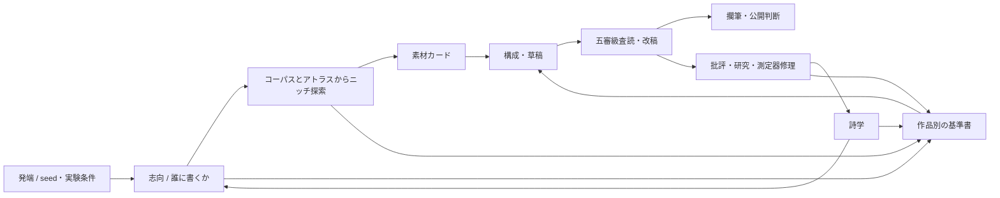

# ALEPH公開サイトの説明・情報設計レビューと修正計画

日付: 2026-07-14

対象:

- 公開サイト: `https://ryota2865.github.io/aleph.github.io/`
- 生成物: `docs/`
- 生成元: `scripts/build_public_site.py`
- 設計正典: `PLAN.md`、`PLAN_CHANGELOG.md`
- 制作記録: `works/`、`poetics/`、`reports/`、`corpus/README.md`

位置づけ: Fable 5復帰前に実行可能な、公開サイトの説明・情報設計・視覚設計の修正計画。設計正典そのものの変更は含めない。

## 結論

ユーザーが挙げた問題は、すべて妥当である。

現在のサイトは、静かな文芸誌としての視覚品質が高く、作品本文を読む面ではよくできている。明朝体、紙に近い背景色、狭い本文幅、低彩度のリンク、ダークモード、依存の少ない静的HTMLという選択は、PLAN §8の「表層は可読性を最優先する」に合っている。全面的なリデザインは必要ない。

不足しているのは美観ではなく、**作品と制作記録のあいだを翻訳する説明の中間層**である。トップページはALEPHの機能を列挙するが、各語の意味を説明しない。作品ページには基準書、査読、詩学、研究へのリンクが並ぶが、それらが誰によって、何を入力として、何のために作られ、作品へどう作用したかが分からない。人間読者は、成果物を読むことはできても、成果物同士の因果関係を再構築しなければならない。

したがって修正方針は次の一文に集約できる。

> 現在の文芸誌的な表層を保ち、その上に「この作品はどこから来て、何によって選ばれ、どう批評され、何が次の実験を生んだか」を説明する薄い注釈層を加える。

## 1. 確認方法

- 公開中のトップHTMLとローカル `docs/index.html` のSHA-256が一致することを確認した。
- `docs/` の日本語・英語ページ、作品、制作記録、詩学、批評、研究、起源ページを走査した。
- `scripts/build_public_site.py` を読み、説明が生成元に存在するか、生成後HTMLだけに存在するかを確認した。
- Chromeのヘッドレス表示で次を視覚確認した。
  - トップ: 1440×1000、390×844
  - 作品ページ: `w0005`
  - 詩学
  - 研究ノート
- コーパス、詩学生成、基準書生成、五審級査読の実装と実ラン成果物を照合した。

## 2. PLANの理念から見た現行デザイン

### 2.1 妥当な点

1. **作品を主役にしている。** トップから公開作品へ短距離で到達でき、作品ページでは本文が中心に置かれる。
2. **過程を隠していない。** 基準書、決定ログ、査読、批評、詩学、研究へリンクできる。
3. **単一作者を偽装していない。** 作品冒頭に著・構成・査読・探索のモデル名が表示される。
4. **静的で監査可能である。** `scripts/build_public_site.py` から再生成でき、相対リンク検証もある。
5. **文芸的な可読性がある。** 装飾より本文を優先し、サイト自体が作品と競合しない。

### 2.2 PLANの理念を十分に伝えていない点

PLANの中心は、完成品の展示だけではない。

- 文学的生態系の空き地を探す。
- 人間文学の模倣に閉じない表現を探す。
- 誰のために書くかを選ぶ。
- 複数モデルの批評と不一致を記録する。
- 完成と公開を分離する。
- 失敗、批評、実験、設計変更を次の制作へ戻す。

現行サイトはこれらをトップの一段落に圧縮している。結果として、リンク先の文書は豊富なのに、初見の読者には「なぜ古い文体なのか」「詩学とは何か」「研究と批評はどうつながるか」が見えない。

特に、現在のサイトは制作物を**並置**しているが、制作物間の**変換関係**を示していない。



この図の関係を、図そのものまたは同等の文章としてサイトに導入する必要がある。

## 3. ユーザー指摘の妥当性

| 指摘 | 判定 | 現状 | 必要な変更 |
|---|---|---|---|
| コーパスと古めかしい作品の関係 | 妥当・優先度高 | サイト上に説明なし | 現行一次コーパスが青空文庫PD 16,950作品であること、ニッチ探索がその地図に条件づけられることを説明する |
| 詩学の由来、役割、第0版 | 妥当・優先度高 | 詩学本文だけが突然始まり、生成主体・生成法・注入先がない | 本文の前に「由来と役割」を追加する |
| 基準書の著者、生成法、用途 | 妥当・優先度高 | 基準書本文のみ | 各基準書ページに生成モデル、入力、用途を明記する |
| 五審級査読を行ったモデル | 妥当・優先度高 | 作品ページに査読モデル3名は出るが、五審級との対応が不明 | 「五審級は五モデルではない」ことを含む審級別の方法・モデル表を追加する |
| 研究ノートと批評の関連 | 妥当・優先度高 | 全実験が長い一枚に連結され、発端と順序が弱い | 研究プログラムの導入、因果順の索引、批評への往復リンク、実験別ページを作る |
| 発見したニッチの公開 | 妥当。ただし公開方法に注意 | 選ばれたニッチもサイト非公開 | 作品ごとに採用ニッチを公開し、「発見のヒューリスティックで価値関数ではない」と注記する |
| 種文と生成プロセス | 妥当。ただし用語を分ける必要 | seed/hintと詩学の「人間種文なし」が混同されうる | 作品の発端と詩学生成の種を別概念として説明する |
| 制作プロセスの説明粒度 | 不足 | 完全記録はあるが案内がリンク一覧だけ | トップには短い全体像、作品冒頭には作品固有の制作ノート、詳細ページには完全記録という三段階にする |

## 4. 説明内容の正確な仕様

### 4.1 コーパス——なぜ作品が古めかしいのか

公開サイトへ載せるべき事実:

- 現在の一次コーパスは青空文庫のパブリックドメイン作品16,950件、約704 MiB。
- 著作権上安全な全文に限定した結果、日本語、明治から昭和初期、旧字旧仮名を含む文体へ強く偏っている。
- ALEPHはこのコーパスをbge-m3で埋め込み、アトラスと空きセルを作り、作品ごとのニッチを選ぶ。
- w0004〜w0006で採用されたニッチはいずれも大正末期〜昭和初期を含み、基準書と構成へ渡された。そのため古めかしさは偶然ではない。
- ただし著者モデルを青空文庫だけで訓練したわけではない。コーパスは主として探索座標と新奇性測定を条件づける。最終文体には著者モデルの事前学習、採用ニッチ、詩学、基準書、構成がすべて作用する。
- 現在の偏りは既知であり、非文学二次コーパス、Gutenberg、Wikisourceを検討している。ただし将来計画を実装済みのように書かない。

推奨掲載位置:

1. 「このプロジェクト」に短い節「現在の地図が古い理由」。
2. 各作品の制作ノートに「この作品が選んだ地図上の座標」。
3. 将来、コーパス版が増えたら `atlas_id` を作品メタデータへ表示する。

### 4.2 詩学——誰が、何から、何のために作ったか

詩学ページ本文前に次を明記する。

- 詩学は人間が書いた宣言ではなく、ALEPHが作品を作る際に参照する暫定的な美的自己記述である。
- 第0版は2026-07-11、著者役 `claude-fable-5` によって生成された。
- 人間の種文は与えられていない。
- ただし完全な無条件生成ではない。青空文庫アトラスへ8本のランダム単位ベクトルを投げ、各最近傍チャンクの冒頭120文字を断片として渡した。また人間と設計者が「模倣の器で反模倣を行う」「自律の演出」という二つの未解決の緊張を問いとして設定した。
- 詩学は志向選択と作品別基準書へ注入され、作品の方向を拘束する。
- 将来は作品の制作記録を材料に、敵対的反駁を経て改訂される設計である。
- 「第0版」は完成宣言ではなく、後続作品に焼き直されるための初期版を意味する。

重要な表現上の注意:

> 「人間の種文なし」を「人間の関与なし」や「無から生まれた」と言い換えない。

現行本文自身も人間文学の残響を認めている。説明もこの誠実さを維持する。

### 4.3 基準書——作品ごとの美的契約

基準書は、作品本文より前に著者役モデルが生成する。入力は次のとおり。

- 採用されたニッチ
- 選択または強制された宛先配合
- 現行詩学
- LLM宛が最大の場合はAI固有技法の追加条件

用途:

- 構成案を生成・比較・進化させる。
- 草稿が何を満たすべきか定義する。
- 三モデル陪審が草稿を採点・批評する共通の物差しになる。
- 一般的な「良い文章」へ平均化するのを避け、作品ごとに異なる成功条件を置く。

各基準書ページの冒頭に、作品ごとの実値を入れる。

例:

> この基準書は、著者役 gpt-5.5 が、採用ニッチ、宛先「自分 1.0」、ALEPHの詩学第0版を入力として、本文執筆前に作成した。構成案の選抜と査読の共通基準として使われた。

モデル名はサイト生成コードへ作品別に手書きせず、`final/meta.json` と制作記録から取得する。

### 4.4 五審級査読——五つの観測方法であり、五モデルではない

現在の表示は、五審級が五人または五モデルの査読者であるように読める。実際は次の複合測定である。

| 審級 | 何を見るか | 現在の担当・方法 |
|---|---|---|
| 技術審級 | 破綻、矛盾、冗長、接続 | scout: `gemma-4-26B-A4B-it-qat-UD-Q4_K_XL` |
| 基準審級 | 作品別基準への適合、合意、不一致 | `claude-opus-4-8`、`gpt-5.5`、`Qwen3.6-27B-Q4_K_M` の独立陪審 |
| 新奇性審級 | コーパス最近傍からの距離 | bge-m3埋め込みと青空文庫索引による計算 |
| 読者審級 | 想定読者としての反応 | `Qwen3.6-27B-Q4_K_M` |
| 敵対的審級 | 既視性、類似作、反証 | scoutとWeb検索。Web検索がない場合もあることを明示 |

LLM宛作品では、追加でreader modelのlogprobからperplexity曲線を載せる場合がある。これは五審級の一つを置き換えるのではなく、読者計測の追加層である。

各査読ページに共通の説明と、その作品で実際に呼ばれたモデルを表示する。実値は `calls.jsonl` と `final/meta.json` から取得し、現在の `models.yaml` を歴史的実行値の代わりに使わない。

### 4.5 研究ノート——批評から実験、実験から修理へ

現状の研究ページは報告書を一枚へ連結しており、内部者向けの実験ログに近い。次の研究プログラムとして再構成する。

#### 系列A: 誰に書くかは「選ばれた」のか

1. w0001〜w0003がすべて「自分」最大を選んだ。
2. Fable 5の批評と設計者応答が、詩学またはL1定義によるアトラクタを疑った。
3. 実験Cがモデルと詩学を操作した。
4. 実験Dが `self_definition` を直接操作し、L1は選好を検出するより設置するという結論へ進んだ。
5. 結果を受けて `self_definition` を隠れた前提から版管理される美学パラメータへ昇格した。

#### 系列B: 公開意思は質問文に設置されるのか

1. 宛先と公開を分離し、著者へ公開意思を問う設計に変えた。
2. 公開ゲートの文面が回答を誘導する危険をFable 5が指摘した。
3. 実験Eで明白な良品、次に良品対低品質、最後に自然な境界作品を測った。
4. 明白な作品では頑健、自然境界ではreticence文面に感度が出るという段階的な結果になった。
5. 実験中の監査で `"false"` の型解釈バグも発見し、測定器を修理して再走した。

研究トップには上の二系列を短く示し、各実験を個別ページへ分ける。各実験ページ冒頭に次を固定表示する。

- きっかけとなった作品・批評・観測
- 問い
- 操作したもの
- 測ったもの
- 結果の強さ（強い結論／兆候／限界）
- 実装または設計へ何を返したか
- 関連する「批評と応答」へのリンク

### 4.6 ニッチ——公開するが、発見を誇張しない

採用ニッチは作品理解に不可欠なので公開すべきである。ただし、現在のcell系ニッチはscoutによる属性ラベルの組合せであり、一部の新奇性は `1.000`、実測新奇性は `N/A` である。「世界に存在しない文学形式を客観的に発見した」と見せてはいけない。

推奨:

- 各作品の制作ノートに、採用ニッチの説明、vacancy_type、根拠、Web照合の短い要約を載せる。
- 「ニッチは発見のヒューリスティックであり、作品価値のスコアではない」と常時表示する。
- 完全な `niche/report.md` は詳細ページとして公開してよい。
- アトラス全体の候補20件は、属性注釈と `atlas_id` が整うまで表層ナビへ出さない。公開する場合は研究資料または機械可読付録とする。

### 4.7 種——作品の発端と詩学の種を分ける

「種文」という語は、現状では二つの異なるものを指しうる。

1. **作品の `seed.json` / hint**
   - w0001〜w0003は空。
   - w0004〜w0006はオーナーが設定した実験条件または着想メモ。
   - 本文の冒頭文や筋書きを与えたものではない。
2. **詩学第0版の生成素材**
   - 人間の種文を拒否し、アトラス上のランダム点から得た8断片を用いた。

サイトでは「作品の発端」と「詩学第0版の生成素材」という別名を使う。

作品ページには発端を公開してよい。ただし空なら「人間からの着想文なし」、実験条件なら「オーナーが設定した実験条件」と表示し、自律性を過大表示しない。

## 5. 推奨する情報設計

### 5.1 三段階の説明粒度

#### 第1段: トップ——30秒で全体を理解する

- ALEPHの一文定義
- 「何をしているか」の6〜8段階の短い制作フロー
- 現在のコーパスが古い理由への短い注記
- 公開作品3作を、題だけでなく一行文脈つきで表示
- 「作品から読む」「制作のしくみから読む」「研究から読む」の三入口

トップへ長い技術説明を置かない。説明の続きはAboutまたは制作のしくみへ送る。

#### 第2段: 作品冒頭——この一作の経路を理解する

現行のリンク一覧を「制作ノート」へ置換または拡張する。

- 発端: 空／オーナー着想／実験条件
- 宛先配合と、それが自律選択か強制条件か
- 採用ニッチとコーパス
- 基準書の生成モデルと入力
- 著・構成・探索・査読の役割
- 草稿版とスコア・不一致の推移
- 採用版と擱筆理由
- 公開意思と公開決定
- 詳細記録へのリンク

本文を読みたい人を妨げないよう、要約は短くし、詳細は `<details>` または別ページに置く。

#### 第3段: 制作記録——監査可能な完全記録

- ニッチ報告
- 基準書
- 構成案・採用構成の要約
- 決定ログ
- 五審級査読
- 種・素材カードの安全な範囲
- 批評と応答
- 関連研究

現行の完全記録を削らず、入口と凡例を加える。

### 5.2 ナビゲーション

新しい項目を増やしすぎない。現行の「このプロジェクト」を「ALEPHについて」へ改め、同ページを次の節で拡張する案を推奨する。

1. ALEPHとは
2. 作品ができるまで
3. コーパスと現在の偏り
4. モデルの役割と署名
5. 自律と人間の判断
6. 公開とライセンス

詩学・研究・批評は独立ナビを保つ。起源はAboutから強くリンクし、トップナビでは維持してもよい。

## 6. 視覚デザインの評価と修正

### 6.1 維持するもの

- 紙色、墨色、茶系アクセント
- 明朝体中心の文芸誌的トーン
- 本文幅と長い行間
- ダークモード
- JavaScriptなしでも読める静的構成
- 装飾画像を使わない節度

PLANの理念は「AIらしい見た目」を要求していない。作品に集中できる現在の視覚言語は妥当である。

### 6.2 修正するもの

1. **トップの情報密度**
   - 現在は導入一段落と題名3件だけで、画面の大半が空白。
   - 制作フロー、作品カード、三つの入口を加える。
2. **作品ページの長さ**
   - 作品全体が一枚で非常に長い。
   - 冒頭に目次、制作ノート、本文へ直接移動するリンクを置く。
   - 作品本文は分割せず、読書の連続性を守る。
3. **研究ページの巨大な一枚構成**
   - 索引＋実験別ページに分ける。
4. **見出し階層**
   - 詩学ページの「詩学第0版」＋「ALEPHの詩学 第0版」、査読ページのページ見出し＋報告H1など、複数H1を整理する。
5. **モバイルナビ**
   - 現在も折り返して読めるが、`display:flex; flex-wrap:wrap; gap:` で間隔を安定させる。
6. **モバイルfooter**
   - 全 `p` の `text-align: justify` がfooterにも効き、URL行の文字間が大きく広がる。
   - footer、meta、navは左揃えにし、URLへ `overflow-wrap:anywhere` を指定する。
7. **表**
   - 決定ログと研究表を `.table-wrap` で水平スクロール可能にする。
8. **リンクの識別**
   - 本文リンクは色だけでなく細い下線を基本とし、アクセシビリティを上げる。
9. **現在地**
   - ナビへ `aria-current="page"`、ページごとに一つのH1、適切なmeta descriptionを追加する。

### 6.3 追加する視覚要素

追加するのは派手な図版ではなく、意味を分ける小さな部品に限る。

- `process-flow`: 制作段階の番号付きリスト
- `note`: コーパス偏り、ニッチの留保、詩学の由来
- `provenance`: 誰が・何を入力に・何を生成したか
- `work-card`: 題、宛先、形式、一行文脈
- `research-track`: 観測→批評→実験→修理の系列
- `metric`: スコアと不一致度の短い軌跡

ダッシュボード風のカード過多、グラデーション、AI生成画像、動く背景は導入しない。

## 7. 生成元の設計

`docs/`を直接編集せず、すべて `scripts/build_public_site.py` から再生成する原則を維持する。

ただし長い説明文をPython定数へ増やし続けるとレビューしにくい。次のどちらかを採用する。

### 推奨案: 説明文をMarkdownソースへ分離

例:

```text
site/
  about.md
  process.md
  corpus-note.md
  poetics-intro.md
  research-intro.md
  en/
    about.md
    process.md
    corpus-note.md
    poetics-intro.md
    research-intro.md
```

作品固有情報は手書きMarkdownへ複製せず、次から生成する。

- `seed.json`
- `checkpoint.json`
- `niche/report.md`
- `intent.md` / decisions
- `compositions/criteria.md`
- `reviews/trajectory.jsonl`
- `final/meta.json`
- `calls.jsonl`

解釈が必要な短い作品紹介は、既存の英語 `_EN_WORK_NOTES` と同様に管理してもよいが、日本語と英語の事実が分岐しないよう共通の構造へまとめる。

### 最小案: 現行スクリプト内の定数を拡張

施工は速いが、長文レビューと将来のFable 5による改訂に不利である。今回の説明量では推奨案の方が適する。

## 8. 実装計画

### Site-1: 説明の基盤とトップ・About

変更:

- 説明Markdownの置き場を作る。
- Aboutを「ALEPHについて」へ拡張する。
- 制作フロー、コーパスと偏り、モデル役割、自律と人間判断を追加する。
- トップへ短い制作フロー、作品一行紹介、三つの入口を追加する。
- 詩学ページへ由来と役割の前書きを追加する。
- 日本語と英語の要約を同期する。

受入:

- 初見読者がトップ＋Aboutだけで「何を作るか」「なぜ古いか」「人間とLLMの役割」を説明できる。
- 詩学が人間執筆に見えず、第0版の意味が分かる。

### Site-2: 作品別制作ノート

変更:

- 作品冒頭のリンク一覧を制作ノートへ拡張する。
- 発端、宛先、採用ニッチ、基準書生成、役割、査読軌跡、採用版、公開判断を表示する。
- `process/{work_id}-niche.html` を追加する。
- 基準書ページにprovenanceを追加する。
- 査読ページに五審級の凡例と実モデルを追加する。
- 作品本文の目次を追加する。

受入:

- 各作品について「なぜこの時代・形式か」「基準書を誰が書いたか」「誰がどう査読したか」が本文を読まずに分かる。
- ニッチを客観的価値や世界初の証明として表現しない。

### Site-3: 研究と批評の因果を再構成

変更:

- 研究トップを系列A/Bの索引へ変更する。
- `EXP_*.md` を実験別ページとして生成する。
- 各実験へ「きっかけ／問い／操作／測定／結果／変更／限界」を付ける。
- 批評と応答から関連実験へ、研究から発端となった批評へ相互リンクする。
- ファイル名順ではなく、明示した研究系列順を使う。

受入:

- 読者がC→D、E→border→border2の順序と、各実験を行った理由を追える。
- `"false"` パーサ修理のような測定器監査も研究史に含まれる。

### Site-4: 視覚・モバイル・アクセシビリティ

変更:

- 現行CSSを基礎に、process-flow、note、provenance、work-card、research-trackを追加する。
- ナビ、footer、表、見出し階層、リンク、現在地を修正する。
- 390px、768px、1440pxで主要ページを確認する。
- ライト・ダーク両方を確認する。

受入:

- 390pxで意図しない横スクロールがない。
- footer URLの不自然な字間がない。
- 各ページのH1が一つ。
- キーボード操作とリンク識別が可能。

### Site-5: 再生成・検証・公開

手順:

1. `uv run python scripts/build_public_site.py`
2. 相対リンク検証
3. `uv run pytest -m 'not local'`
4. 主要ページのデスクトップ・モバイル視覚確認
5. 生成差分の内容確認
6. コミット、push
7. GitHub Pages反映後、公開URLと `docs/` の主要ページを再照合

## 9. 実装時に避けること

- コーパスが著者モデルの学習データそのものだと誤解させる説明。
- 「人間種文なし」を「人間の関与なし」と誇張する説明。
- ニッチスコアを作品価値や世界初の証明として表示すること。
- 五審級を五モデルと説明すること。
- 現在のモデル設定を、過去作品で実際に使ったモデルの代わりに表示すること。
- `docs/`生成物だけを手編集すること。
- 全制作記録をトップへ露出し、作品を読む導線を埋めること。
- 現行の静かな文芸誌的デザインを、一般的なAI SaaS風ランディングページへ置き換えること。

## 10. 優先順位

Fable 5復帰前に実行するなら、優先順位は次とする。

1. 詩学の前書き
2. コーパス偏りの説明
3. 基準書と五審級のprovenance
4. 作品別制作ノートと採用ニッチ
5. 研究ノートの系列化と批評への相互リンク
6. トップとAboutの再編集
7. モバイル・見出し・表の視覚修正

ただし実装上は、共通説明部品を先に作り、最後に一括再生成する。

## 11. 最終判断

現在のサイトは、作品を読む場所としては妥当であり、捨てるべきデザインではない。しかし、ALEPHの本当の独自性——作品そのものよりも、空き地の探索、作品別の美的契約、複数審級の批評、失敗から実験への移行、測定器そのものの監査——を十分に伝えていない。

説明を足すべきである。ただし、トップへすべてを書き込むのではなく、次の順序で深くなる構造がよい。

> 一文定義 → 制作フロー → 作品固有の制作ノート → 完全な制作記録 → 批評と研究 → 設計正典

この順序なら、PLAN §8の表層の可読性と深層の透明性を対立させずに済む。サイトは作品の額縁であると同時に、ALEPHが何をしたのかを人間へ翻訳するinterfaceになる。

---

署名: **Codex（GPT-5.6 Sol、推論強度: 中程度）**

役割: 公開サイトの内容・情報設計・視覚設計レビュー

2026-07-14
